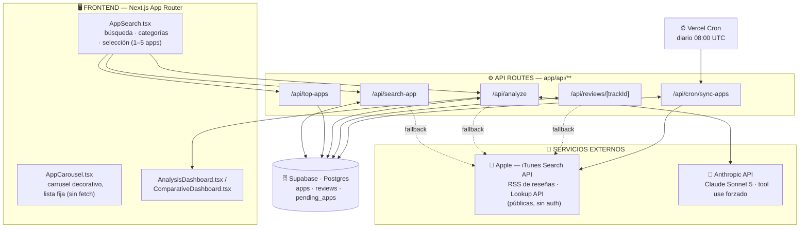
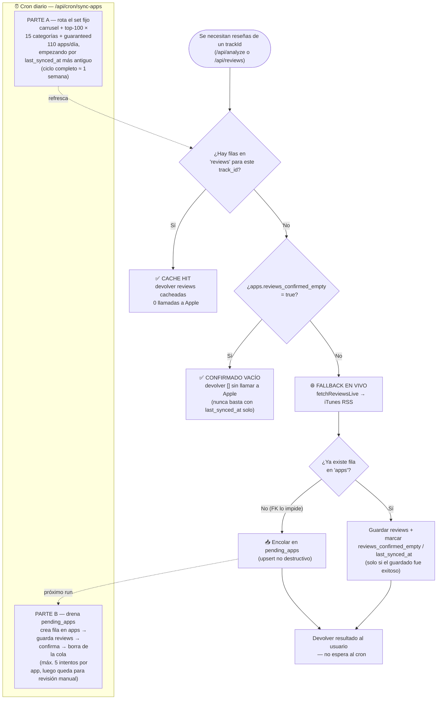

# Benchmark Review Intelligence 🇨🇱

Dado el nombre de una o varias apps, la herramienta trae sus reseñas reales de la App Store
chilena y usa Claude para sintetizar inteligencia de producto a partir de ellas: sentimiento,
quejas recurrentes, features pedidas por los usuarios y, si se seleccionan varias apps del
mismo tipo, una comparativa por dimensión con un veredicto de cuál es la mejor y por qué.

Pensado como caso de estudio de **vibe-coding**: llevar una idea de cero a producción con
Claude Code, incluyendo los golpes reales de meter datos externos (rate-limiting de Apple,
bugs de integridad referencial, glitches transitorios de una API de terceros) que no aparecen
en un demo de "hola mundo".

## 🔗 Demo en vivo

**[reviewbi.vercel.app](https://reviewbi.vercel.app)**

## 🏗️ Arquitectura

### Vista general



Cada API route decide primero si puede responder desde Supabase; solo si el cache no alcanza
cae a una llamada en vivo a Apple. `/api/analyze` nunca llama a Apple ni a Supabase
directamente — delega esa decisión a `lib/reviews.ts`, la misma función que usa
`/api/reviews/[trackId]`, así la lógica de cache vive en un solo lugar.

### Flujo de cache: hit, fallback en vivo, cola y cron

Esta es la parte más elaborada del proyecto — decide, para cada request de reseñas, si Apple
necesita ser consultado o no, y qué hacer con lo que encuentra.



## 🧱 Stack técnico

| Pieza | Por qué |
|---|---|
| **Next.js (App Router)** | API routes y frontend en un solo proyecto, deploy directo a Vercel sin backend separado. |
| **Vercel** | Deploy del frontend/API routes y el runtime de los Cron Jobs, sin infraestructura propia que mantener. |
| **Supabase (Postgres)** | Cache relacional simple con REST client oficial; suficiente para 3 tablas con una FK, sin necesitar un ORM. |
| **Anthropic API (Claude Sonnet 5)** | Tool use forzado (`tool_choice`) para garantizar una salida JSON estructurada y en español, sin parsers frágiles. |
| **APIs públicas de Apple** | iTunes Search/RSS/Lookup no requieren auth ni API key — cero fricción para arrancar el proyecto. |

## 💡 Decisiones clave y por qué

**Cero APIs con fricción de auth desde el día 1.** Un proyecto anterior (un comparador de
precios de bencinas sobre la API de la CNE) se empantanó en gestión de credenciales y
registro antes de escribir la primera línea de lógica de negocio. Acá el criterio fue
explícito: arrancar solo con APIs de Apple sin auth y una sola API key (Anthropic), para que
el tiempo se fuera en el producto, no en plumbing.

**Supabase se agregó después del MVP, no antes.** Las primeras ~25 features de este proyecto
(búsqueda, reseñas, análisis single y comparativo, categorías) se construyeron pegándole en
vivo a las APIs de Apple en cada request — sin cache. Supabase entró recién cuando ese
approach chocó con un problema real de producción: Apple empezó a rate-limitear las llamadas
al feed RSS de reseñas. El cache no fue una decisión de arquitectura anticipada, fue la
respuesta a un límite real que apareció usando la app.

**El sistema de cache, en simple:** cada endpoint intenta responder desde Supabase primero;
si no hay suficiente ahí, cae a una llamada en vivo a Apple. Una app completamente nueva
(nunca vista) no puede insertar sus reseñas todavía —tienen una FK a la tabla `apps`— así que
se responde igual al usuario con el resultado en vivo y la app queda encolada en
`pending_apps` para que el cron la termine de integrar. Un cron diario tiene dos trabajos:
rota el set fijo de ~1.300 apps (carrusel + top de cada categoría) para que ninguna quede
desactualizada por más de una semana, y drena esa cola de apps nuevas descubiertas
orgánicamente por los usuarios.

**Tool use forzado para el análisis de Claude.** `/api/analyze` llama a Claude con
`tool_choice: { type: "tool", name: "..." }`, no con un prompt pidiendo JSON. Esto obliga al
modelo a responder siempre con un `tool_use` block que cumple el `input_schema` declarado
(enums, arrays con `minItems`/`maxItems`, campos requeridos) — no hay parsing de texto libre
ni validación manual de una respuesta que podría no ser JSON válido.

### 🐛 Bugs reales encontrados y corregidos

- **El glitch transitorio de Apple con Santander Chile.** El seed inicial marcó Santander
  Chile como sincronizado (`last_synced_at` seteado) con 0 reseñas guardadas, pese a que tiene
  decenas de miles en Apple — el fetch en vivo de ese momento devolvió un RSS vacío con HTTP
  200, indistinguible en el código de una app genuinamente sin reseñas. La corrección fue
  dejar de confiar solo en `last_synced_at` y agregar una columna `reviews_confirmed_empty`,
  que solo se marca en `true` cuando un fetch **y** su guardado posterior se confirman
  exitosos en la misma corrida — nunca en un éxito parcial.

- **El bug de FK por orden de escritura al integrar apps nuevas.** El fix de Santander
  introdujo un orden reseñas-antes-que-apps que asumía que la fila en `apps` ya existía — cierto
  para un refresh, falso para una app genuinamente nueva. Como `reviews.track_id` tiene FK a
  `apps.track_id`, cada inserción de reseñas para una app nueva fallaba silenciosamente,
  tragándose las reseñas de ~450 apps nuevas en la primera corrida de la expansión de
  categorías. La corrección: crear la fila en `apps` primero, siempre, en los dos lugares
  donde ocurre esta lógica (el cron y el script de seed).

- **El country faltante en el lookup de metadata.** La API de iTunes Lookup devuelve rating y
  conteo de reseñas *por storefront* — sin pasar `country=CL` explícito, apps que solo existen
  o solo tienen actividad real en la tienda chilena (ej. Fintoc Me) volvían con
  `averageUserRating: 0` en vez de su 4.6 real, y en modo comparativo el nombre de esas apps se
  mostraba como el placeholder `App {trackId}` en vez de su nombre real.

## ✨ Features

- Búsqueda de apps (cache-first, con fallback en vivo a iTunes Search)
- Análisis single: sentimiento, quejas recurrentes, features pedidas, temas destacados
- Comparación de 2 a 5 apps: rankings por dimensión, quejas transversales, diferenciadores y
  conclusión con la mejor app del set
- Módulo de categorías: 15 categorías, top 100 real por rating (no un chart genérico)
- Dark mode
- Carrusel de descubrimiento (apps curadas, orden fijo)
- Localización a Chile: App Store CL por defecto, UI en español

## 🚀 Cómo correrlo localmente

Variables de entorno necesarias (`.env.local`):

```
ANTHROPIC_API_KEY=
SUPABASE_URL=
SUPABASE_SECRET_KEY=
CRON_SECRET=
```

```bash
npm install
npm run dev
```

Abrir [http://localhost:3000](http://localhost:3000).

El schema de Supabase vive en `supabase/schema.sql` (pegar en el SQL Editor del proyecto). El
seed inicial de apps/reseñas está en `scripts/seed-initial.ts`.

## 🙌 Créditos

Construido de principio a fin con [Claude Code](https://claude.com/claude-code), como
proyecto de portafolio.
