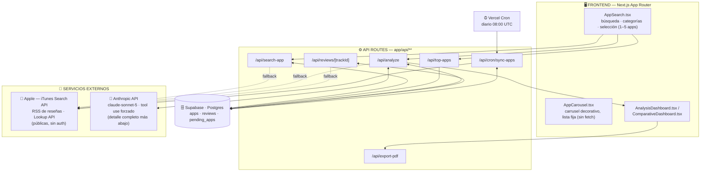
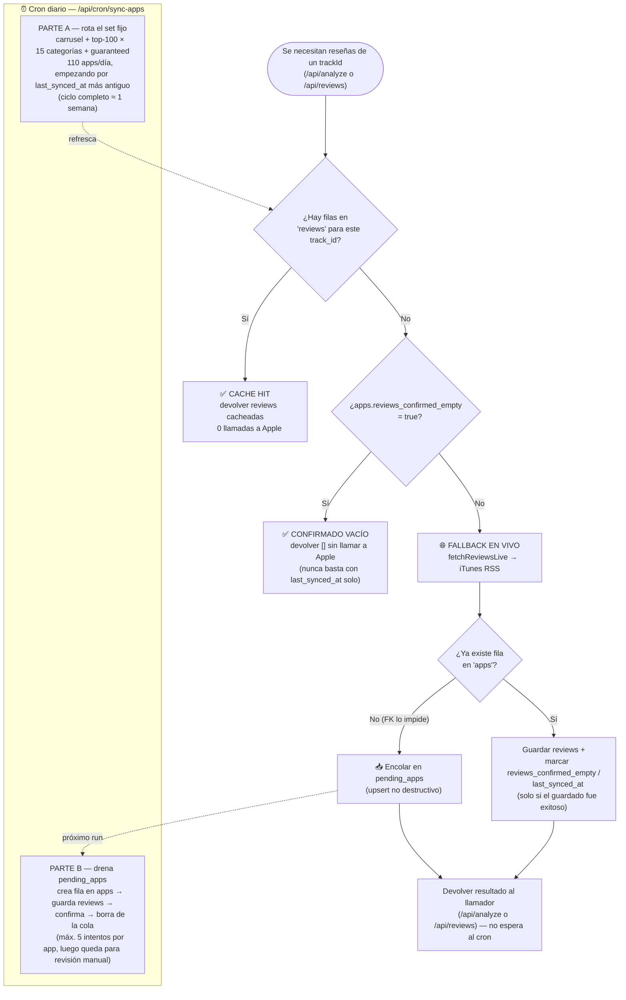
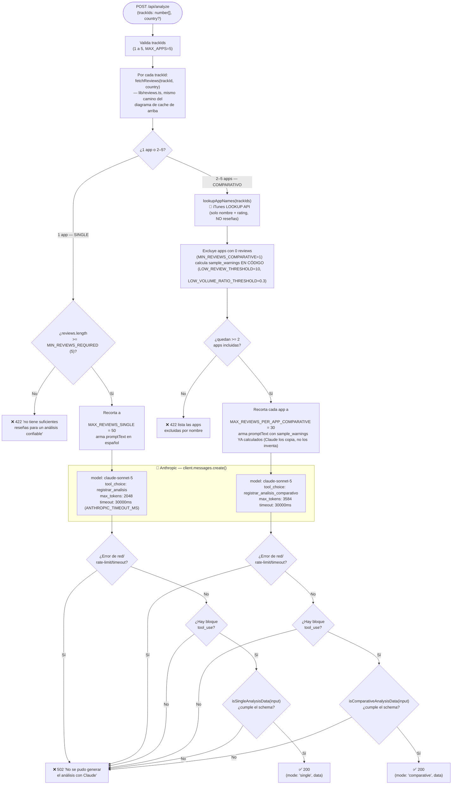

# Diagramas de arquitectura — Benchmark Review Intelligence 🇨🇱

Documento técnico de referencia, migrado y extendido a partir de la sección
`## 🏗️ Arquitectura` de `README.md`. Los dos primeros diagramas (vista
general y flujo de cache) documentan la conexión con Apple/Supabase/cron;
este archivo agrega el mismo nivel de detalle para la conexión con la API
de Anthropic (Claude), que hasta ahora solo se mencionaba de pasada.

Todo lo aquí escrito está confirmado línea por línea contra el código
actual (`app/api/analyze/route.ts`, `lib/reviews.ts`, `lib/appLookup.ts`),
no reconstruido de memoria — cada afirmación específica (modelo, timeouts,
schemas, validadores) cita el archivo y, cuando aplica, el nombre exacto de
la constante o función.

## Vista general



Cada API route decide primero si puede responder desde Supabase; solo si el
cache no alcanza cae a una llamada en vivo a Apple. `/api/analyze` nunca
llama a Apple directamente — delega esa decisión a `lib/reviews.ts`
(`fetchReviews`), la misma función que usa `/api/reviews/[trackId]`, así la
lógica de cache vive en un solo lugar. Y **Claude nunca llama a Apple ni a
Supabase**: solo recibe, dentro del prompt, el texto de reseñas que
`/api/analyze` ya resolvió de antemano — ver la sección dedicada más abajo.

`/api/export-pdf` no tiene fuente de datos propia: recibe el `{ mode, data
}` que el frontend ya obtuvo de `/api/analyze` y lo renderiza a PDF
server-side (`@react-pdf/renderer`) — no vuelve a tocar Supabase, Apple ni
Anthropic.

## Flujo de cache: hit, fallback en vivo, cola y cron

Esta es la parte más elaborada del proyecto — decide, para cada request de
reseñas, si Apple necesita ser consultado o no, y qué hacer con lo que
encuentra. Es también, literalmente, el primer paso de todo lo que le llega
a Claude: `/api/analyze` pasa por este mismo camino para cada trackId antes
de construir cualquier prompt.



## Conexión con la API de Anthropic (Claude)

`/api/analyze` (`app/api/analyze/route.ts`) es el único punto del proyecto
que llama a Anthropic. Todo lo que sigue está confirmado contra ese archivo
tal como existe hoy en el repo.

### 1. Modelo exacto

```ts
// líneas 369 y 518 — idéntico en ambas llamadas (single y comparativa)
model: "claude-sonnet-5",
```

Un único cliente `const client = new Anthropic();` (línea 6, sin config
extra — la API key sale de `ANTHROPIC_API_KEY` vía SDK), reutilizado para
ambos modos.

### 2. Tool use forzado — qué problema resuelve y qué NO resuelve

```ts
// modo single (línea 372)
tool_choice: { type: "tool", name: "registrar_analisis" }

// modo comparativo (línea 521)
tool_choice: { type: "tool", name: "registrar_analisis_comparativo" }
```

En vez de pedirle a Claude "responde en JSON" en el prompt y parsear texto
libre, `tool_choice` fuerza al modelo a devolver siempre un bloque
`tool_use` que invoca esa tool específica — elimina de raíz la clase de
bug "el modelo agregó texto antes/después del JSON" o "el JSON no
parsea".

Pero forzar la tool **no garantiza que su `input` cumpla el
`input_schema`** declarado (enums, `minItems`/`maxItems`, campos
requeridos) — Claude puede llamar a la tool correcta con un campo faltante,
un tipo equivocado, o un array vacío donde se pedían 3 elementos mínimo.
Por eso el código no confía ciegamente en el `tool_use` block: lo pasa por
un validador de shape antes de devolverlo al frontend (punto 6). El
comentario del propio código lo deja explícito (línea 146):

> "tool_choice forcing Claude to call ... makes it call the tool, but
> nothing guarantees the resulting `input` actually matches the
> input_schema declared above"

### 3. Los dos schemas (`input_schema` de cada tool)

**Modo single — `registrar_analisis`** (líneas 30–69):

```ts
{
  sentiment: {
    label: "positivo" | "negativo" | "mixto",   // enum
    score: number,                               // 0–100
    justification: string,
  },
  recurring_complaints: string[],
  requested_features: string[],
  highlighted_themes: {                          // minItems 3, maxItems 5
    theme: string,
    description: string,
  }[],
}
// required: [sentiment, recurring_complaints, requested_features, highlighted_themes]
```

**Modo comparativo — `registrar_analisis_comparativo`** (líneas 71–144):

```ts
{
  apps_analyzed: { trackId: number, appName: string, reviewCount: number }[],
  sample_warnings: string[],
  dimension_rankings: {                          // minItems 3, maxItems 4
    dimension: string,
    ranking: { appName: string, note: string }[],
  }[],
  category_wide_complaints: string[],
  differentiators: { appName: string, differentiator: string }[],
  conclusion: { best_app: string, reasoning: string },
}
// required: [apps_analyzed, sample_warnings, dimension_rankings,
//            category_wide_complaints, differentiators, conclusion]
```

Son dos tools completamente separadas (`registrarAnalisisTool` y
`registrarAnalisisComparativoTool`), cada una con su propio `tool_choice` —
nunca se le ofrecen ambas a Claude en la misma llamada.

### 4. De dónde salen las reseñas del prompt — Claude nunca habla con Apple



El único servicio de Apple que toca el modo comparativo antes de llamar a
Claude es **iTunes Lookup** (`lookupAppNames`, `lib/appLookup.ts`) — y solo
para resolver `appName`/rating cuando el nombre no viene ya cacheado, nunca
para traer reseñas. Las reseñas en sí, en ambos modos, salen exclusivamente
de `fetchReviews` (`lib/reviews.ts`): cache de Supabase primero, RSS de
Apple en vivo solo si el cache no tiene nada — el mismo camino documentado
en el diagrama de cache de la sección anterior. **Claude en ningún momento
recibe una URL de Apple ni hace su propia llamada externa** — solo texto
plano ya resuelto, incrustado en `promptText`.

### 5. Timeout configurado en la llamada a Anthropic

```ts
// línea 28
const ANTHROPIC_TIMEOUT_MS = 30_000; // 30 segundos

// pasado como segundo argumento a client.messages.create(...) en AMBAS
// llamadas (líneas 375 y 524):
{ timeout: ANTHROPIC_TIMEOUT_MS }
```

El comentario del propio código (ALV-94, líneas 22–27) explica el porqué:
cubre con margen el caso legítimo conocido de 15–20s que toma la síntesis
real, y evita que un request colgado hacia Anthropic arrastre la función
serverless hasta su propio límite de plataforma. Al vencer, el SDK lanza
`Anthropic.APIConnectionTimeoutError`, que cae en el mismo `try/catch` que
ya maneja cualquier otra falla de Anthropic (rate limit, 5xx, error de
red) — sin manejo especial adicional, y con el mismo mensaje 502 genérico.

### 6. Validadores de shape — qué pasa si Claude no cumple el schema

```ts
function isSingleAnalysisData(value: unknown): boolean { ... }       // línea 168
function isComparativeAnalysisData(value: unknown): boolean { ... }  // línea 196
```

Corren inmediatamente después de encontrar el bloque `tool_use`, antes de
que la respuesta llegue al frontend. Verifican, campo por campo, lo mismo
que el `input_schema` de la tool declara: el enum de `sentiment.label`, que
`score` sea un `number` finito, que cada array de strings sea realmente un
array de strings, que `highlighted_themes`/`dimension_rankings` tengan la
forma `{theme, description}` / `{dimension, ranking}` en cada elemento,
etc.

**Si no hay bloque `tool_use` en la respuesta, o el `input` no pasa el
validador correspondiente, ambos casos se tratan exactamente igual**
(líneas 389 y 538):

```ts
if (!toolUseBlock || !isSingleAnalysisData(toolUseBlock.input)) {
  console.error(/* shape recibido, para debug */);
  return NextResponse.json(
    { error: "No se pudo generar el análisis con Claude" },
    { status: 502 }
  );
}
```

Un shape inválido nunca llega al frontend como un objeto a medio llenar
que rompería `AnalysisDashboard`/`ComparativeDashboard` con un
`TypeError` en tiempo de render — se degrada al mismo 502 controlado que
ya existía para "Claude no devolvió nada usable".

### Referencia rápida — constantes de `/api/analyze`

| Constante | Valor | Aplica a |
|---|---|---|
| `MAX_APPS` | 5 | Tope de trackIds por request |
| `MIN_REVIEWS_REQUIRED` | 5 | Mínimo para analizar 1 sola app (si no, 422) |
| `MAX_REVIEWS_SINGLE` | 50 | Tope de reseñas enviadas a Claude en modo single |
| `MIN_REVIEWS_COMPARATIVE` | 1 | Mínimo de reseñas para que una app entre al set comparativo |
| `MAX_REVIEWS_PER_APP_COMPARATIVE` | 30 | Tope de reseñas por app enviadas a Claude en modo comparativo |
| `LOW_REVIEW_THRESHOLD` | 10 | Bajo esto, la app se marca de baja confianza en `sample_warnings` |
| `LOW_VOLUME_RATIO_THRESHOLD` | 0.3 | Umbral relativo a la app con más reseñas del set |
| `ANTHROPIC_TIMEOUT_MS` | 30 000 (30s) | Timeout de `client.messages.create()`, ambos modos |
| `max_tokens` (single) | 2048 | Llamada con `registrar_analisis` |
| `max_tokens` (comparativo) | 3584 | Llamada con `registrar_analisis_comparativo` |

## Tabla resumen de endpoints

| Endpoint | Método | Fuente de datos (orden real) | Fallback en vivo |
|---|---|---|---|
| `/api/search-app` | GET | Supabase `apps` (`ILIKE` sobre `track_name`) | 🍎 iTunes Search API — solo si el cache trae menos de 3 resultados |
| `/api/top-apps` | GET | Supabase `apps` (pre-sembrado por el cron/seed) | Ninguno — devuelve menos de 15 resultados antes que volver a llamar a Apple por request |
| `/api/reviews/[trackId]` | GET | Supabase `reviews` vía `fetchReviews` (`lib/reviews.ts`) | 🍎 iTunes RSS de reseñas, solo si no hay cache ni `reviews_confirmed_empty=true` |
| `/api/analyze` | POST | Supabase `reviews` vía `fetchReviews` (mismo camino que arriba) **+ 🤖 Anthropic API (`claude-sonnet-5`, tool use forzado) para sintetizar el análisis** | 🍎 iTunes RSS (heredado de `fetchReviews`) para reseñas; 🍎 iTunes Lookup API solo en modo comparativo, solo para nombres/rating |
| `/api/export-pdf` | POST | Ninguna propia — recibe `{ mode, data }` ya resuelto por `/api/analyze` desde el frontend | Ninguno (no llama a Apple, Supabase ni Anthropic) |
| `/api/cron/sync-apps` | POST (cron, `CRON_SECRET`) | Supabase `apps` / `pending_apps` / `reviews` | 🍎 iTunes RSS + Lookup, incondicional (`fetchReviewsLive`) — es el único endpoint que siempre llama a Apple, nunca lee el cache primero |

`/api/analyze` es, por lejos, el endpoint con más dependencias externas del
proyecto: es el único que combina las tres fuentes (Supabase, Apple y
Anthropic) en una sola respuesta.
